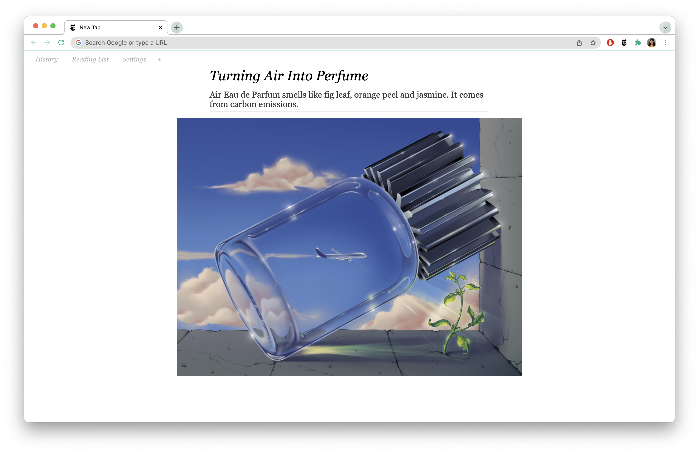
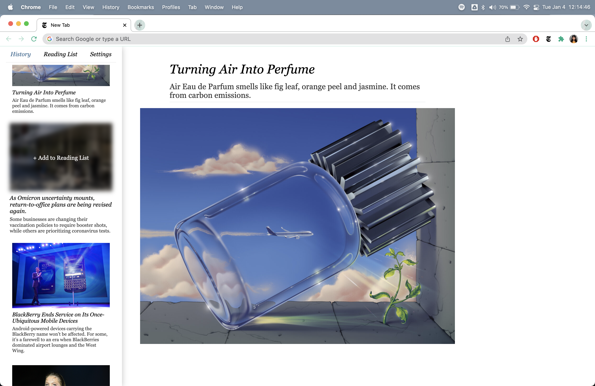

# NYT Headlines New Tab

This Chrome extension provides a fast, elegant interface for you to stay up to date with the top headlines from The New York Times.

### Features

-   Each new tab page will generate a random article from The New York Times’ homepage
-   History list keeps track of recently loaded articles
-   Reading list lets you save articles for later
-   Light/Dark mode!
-   Specify which of 24 different news categories you see

### How to install:

1. Download the ZIP file repository
2. Go to chrome://extensions/
3. At the top right, turn on developer mode
4. At the top left, click “Load unpacked”
5. Upload the unzipped folder
