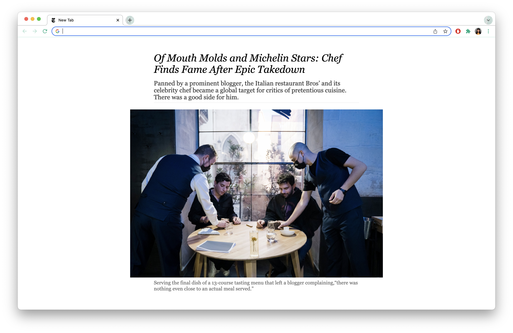

# NYT Headlines New Tab

This Chrome extension provides an elegant, accessible interface for you to stay up to date with the top headlines from The New York Times.

### Features

- Opening a new tab will generate a random article from The New York Times’ homepage
- Clicking on the headline will take you to the article webpage
- Hovering over the image will reveal its caption, if there is one

### How to install:

1. Download the ZIP file repository
2. Go to chrome://extensions/
3. At the top right, turn on developer mode
4. At the top left, click “Load unpacked”
5. Upload the unzipped folder